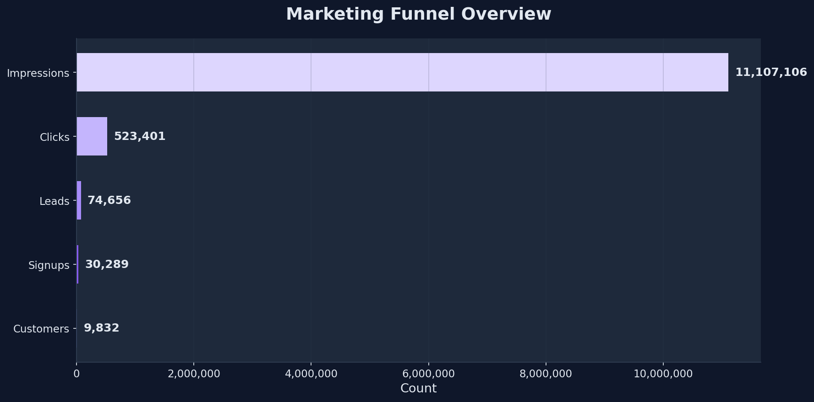
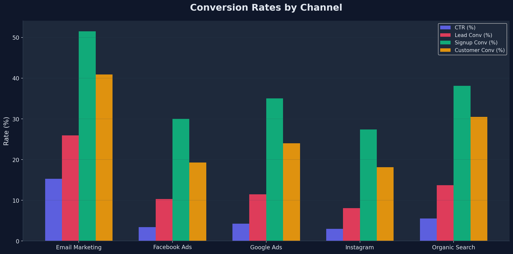
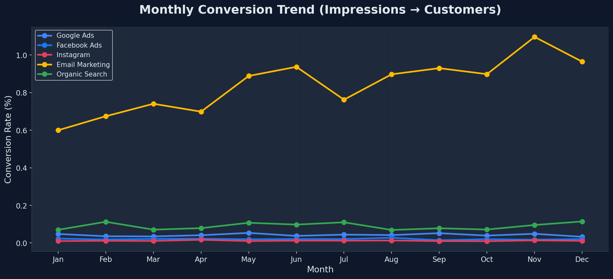
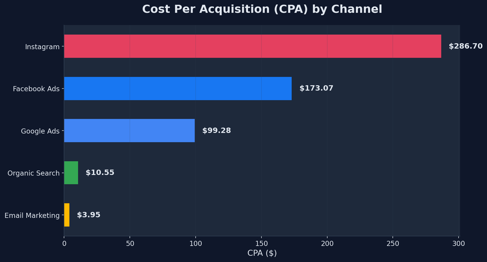
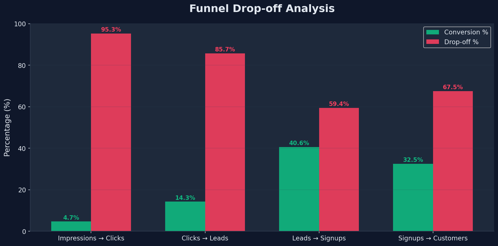
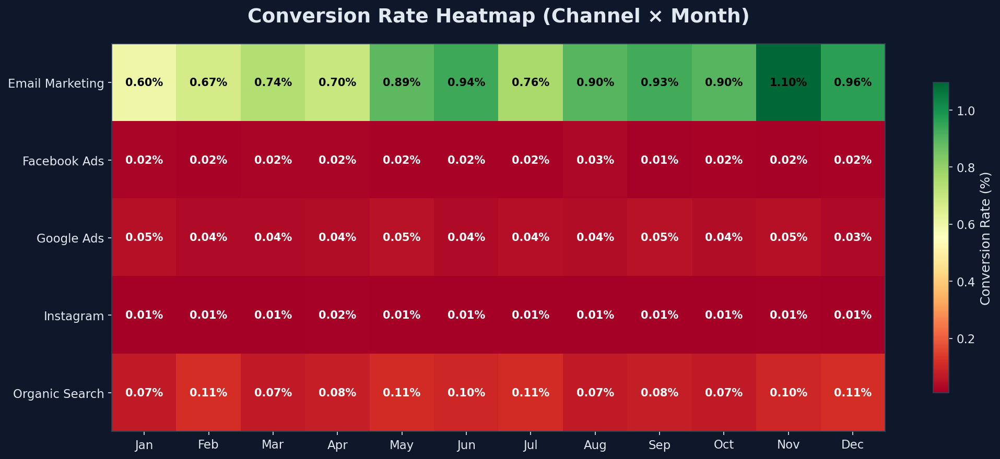

# Marketing Funnel & Conversion Performance Analysis


---

## Objective

Analyze marketing funnel performance across **5 marketing channels** to identify conversion bottlenecks, evaluate channel effectiveness, and provide actionable recommendations for improving customer acquisition and marketing ROI.

## Business Problem

A company runs marketing campaigns through multiple channels:

- **Google Ads** — High-volume paid search
- **Facebook Ads** — Social media advertising
- **Instagram** — Visual platform campaigns
- **Email Marketing** — Direct email outreach
- **Organic Search** — SEO-driven traffic

Management needs to understand:
- Which channels generate the most customers
- Where potential customers drop out of the funnel
- How to improve overall conversion performance
- Which channels provide the best ROI

---

## Key Metrics

| Metric | Formula |
|--------|---------|
| **Click Through Rate (CTR)** | (Clicks / Impressions) × 100 |
| **Lead Conversion Rate** | (Leads / Clicks) × 100 |
| **Signup Conversion Rate** | (Signups / Leads) × 100 |
| **Customer Conversion Rate** | (Customers / Signups) × 100 |
| **Cost Per Acquisition (CPA)** | Campaign Cost / Customers |
| **Overall Conversion** | (Customers / Impressions) × 100 |

---

## Tools Used

| Category | Tools |
|----------|-------|
| Data Analysis | Python, Pandas, NumPy |
| Visualization | Matplotlib, Chart.js |
| Dashboard | HTML/CSS/JavaScript (Interactive) |
| Development | Jupyter Notebook, VS Code |

---

## Project Structure

```
FUTURE_DS_03/
│
├── dataset/
│   └── marketing_data.csv          # Synthetic marketing funnel data
│
├── notebook/
│   └── marketing_funnel_analysis.ipynb  # Full analysis notebook
│
├── dashboard/
│   └── index.html                  # Interactive HTML dashboard
│
├── scripts/
│   ├── generate_dataset.py         # Synthetic data generator
│   └── analysis.py                 # Standalone analysis script
│
├── screenshots/
│   ├── funnel_overview.png         # Funnel bar chart
│   ├── channel_comparison.png      # Conversion rates by channel
│   ├── monthly_trend.png           # Monthly conversion trends
│   ├── cpa_by_channel.png          # CPA comparison
│   ├── dropoff_analysis.png        # Funnel drop-off chart
│   └── heatmap.png                 # Channel × Month heatmap
│
├── .gitignore
└── README.md
```

---

## How to Run

### 1. Install Dependencies
```bash
pip install pandas numpy matplotlib
```

### 2. Generate Dataset
```bash
python scripts/generate_dataset.py
```

### 3. Run Analysis
```bash
python scripts/analysis.py
```

### 4. Open Dashboard
Open `dashboard/index.html` in any web browser.

### 5. Jupyter Notebook
```bash
jupyter notebook notebook/marketing_funnel_analysis.ipynb
```

---

## Key Findings

### Channel Performance

| Channel | Overall Conv (%) | CPA ($) | Role |
|---------|-----------------|---------|------|
| Email Marketing | 0.836% | $3.95 | Best converter, lowest CPA |
| Organic Search | 0.089% | $10.55 | Strong mid-funnel, cost-effective |
| Google Ads | 0.041% | $99.28 | High volume lead generator |
| Facebook Ads | 0.020% | $173.07 | Moderate performance |
| Instagram | 0.012% | $286.70 | Lowest conversion, highest CPA |

### Funnel Drop-off

| Stage Transition | Drop-off Rate |
|-----------------|---------------|
| Impressions → Clicks | 95.3% |
| Clicks → Leads | 85.7% |
| Leads → Signups | 59.4% |
| Signups → Customers | 67.5% |

---

## Recommendations

1. **Increase Email Marketing budget** — Highest conversion rate and lowest CPA
2. **Optimize ad creative** — 95% of impressions don't result in clicks
3. **Reduce Instagram CPA** — Refine targeting or reallocate budget
4. **Improve signup flow** — 59-68% drop-off at signup/customer stages
5. **Run retargeting campaigns** — Recover abandoned leads
6. **Plan Q4 campaigns aggressively** — Seasonal data shows 15-25% higher conversions

---

## Screenshots

### Funnel Overview


### Channel Comparison


### Monthly Trend


### CPA by Channel


### Drop-off Analysis


### Conversion Heatmap


---

## Interactive Dashboard

Open [dashboard/index.html](file:///d:/pro3/FUTURE_DS_03/dashboard/index.html) in your browser for a fully interactive dashboard featuring:
- **📂 Custom Data Upload**: Upload any custom dataset in CSV format (matching the schema of [marketing_data.csv](file:///d:/pro3/FUTURE_DS_03/dataset/marketing_data.csv)) to analyze and visualize your own marketing data dynamically.
- **🎯 Dynamic Filtering**: Filter funnel performance, KPIs, and charts in real-time by marketing channel and time periods (specific months or quarters).
- **📊 Interactive Charts**: Real-time rendering using Chart.js, including:
  - KPI summary cards
  - Dynamic customer journey funnel viz
  - Conversion rates by channel
  - Cost Per Acquisition (CPA) rankings
  - Monthly conversion trend analysis
  - Funnel stage drop-off analysis
  - Customers acquired breakdown
- **💡 Real-Time Insights**: Auto-generated business insights and campaign optimization recommendations that adapt dynamically to your selected filters or uploaded dataset.

---

## Attribution

This project was completed as part of **Future Interns Task 3: Marketing Funnel & Conversion Performance Analysis**.

---
